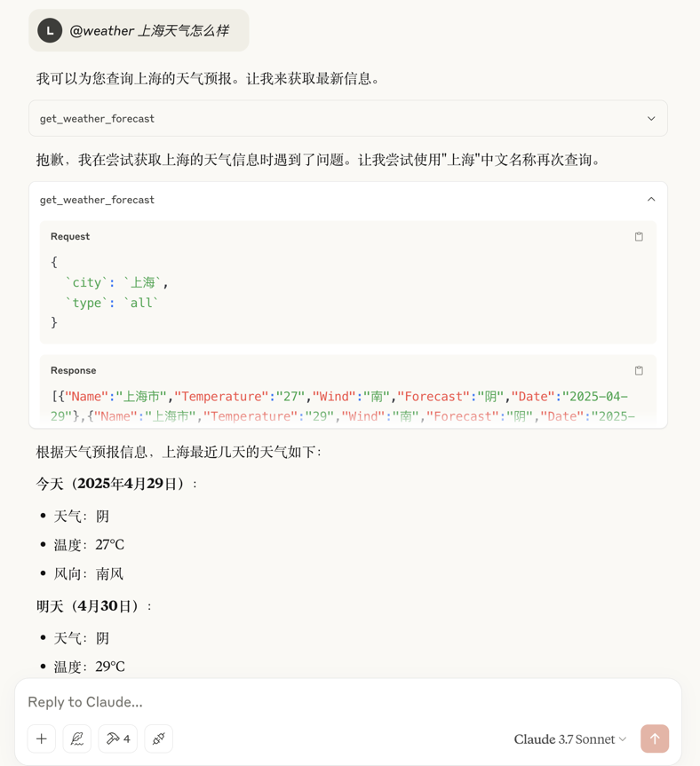

# mcp-wather
> 一个简单的 mcp 查询天气服务端

## 介绍

## 功能
- 查询天气（高德天气API）

## 使用
```shell
git clone https://github.com/Lucareful/mcp-wather.git

# 生成二进制文件
go build -o forecast . 
```

## 配置 mcp 服务器
```json

{
    "mcpServers": {
        "weather": {
            // 程序二进制路径 
            "command": "/your-path/forecast" 
        }
    }
}

```

## 运行截图



